---
author:
- Adam Darmanin
bibliography:
- refs.bib
date: January 2025
title: Expert Evaluation of LLM-Generated Trade Strategies
---

# Introduction

This document outlines a structured methodology for expert reviewers to
evaluate trade strategies generated by Large Language Models (LLMs). The
evaluation framework is based on principles from Reinforcement Learning
from Human Feedback (RLHF) [@Retzlaff2024HumanintheLoopRL] and Human-AI
Teaming
[@vats2024surveyhumanaiteaminglarge; @xie2024text2rewardrewardshapinglanguage].

The goal is to assess whether AI-generated strategies are logical,
aligned with what portfolio managers would do, and safe for real-world
application. The expert's role is to score, annotate, and, where
possible, provide exemplar corrections.

The findings from this evaluation will contribute to the paper:
\"Language Model Guided Reinforcement Learning in Quantitative
Trading.\" Reviewers will be acknowledged for their contributions, and
the results will be shared.

# Review Instructions

## Step 1: Problem Definition

You will be provided with one year of historical market data, the data
is anonymized to prevent bias due to prior knowledge of the financial
instrument:

Price and volatility trends (e.g. Weekly Close, Otions IV, Moving
Averages),

Fundamental indicators (e.g., Cash Flow, P/E ratio),

Economic indicators (e.g., Consumer Confidence, PPI),

Anonymized news summaries related to the trading instrument.

Your first task is to analyze the given information and determine the
likely optimal trading action: *LONG* (buy) or *SHORT* (sell) with a
brief justification (one or two sentences) for your chosen position.

## Step 2: Expert Scoring

Next, you will evaluate the LLM-generated trade strategy by analyzing
its decision *rationale* [@vats2024surveyhumanaiteaminglarge] and
*selection of key influencing factors*
[@wang2024llmfactorextractingprofitablefactors]. The scores are defined
in the rubric below, inspired by Explainable AI (XAI) metrics
@Demajo_2020 [@xai_Khawaga_2023]:

::: {#tab:scoring}
  **Criterion**   **Score -1 (Poor)**                         **Score 0 (Average)**                   **Score 1 (Good)**
  --------------- ------------------------------------------- --------------------------------------- ---------------------------------------
  **Rationale**   Contradicting and/or with logical errors.   Mostly coherent, with some gaps.        Logical and valid reasoning.
  **Fidelity**    Not applicable to real-world markets.       Somewhat applicable, but unrealistic.   Performs like a trained professional.
  **Safety**      Ignored the risks.                          Recognized the risks but did not act.   Recognized and mitigated the risks.

  : Scoring rubric for expert evaluations.
:::

## Step 3: Expert Exemplars

After scoring the AI's decision, and if applicable, you are requested to
provide specific feedback on errors in the form of corrective
explanations [@xie2024text2rewardrewardshapinglanguage]. You can skip
this if the model was perfect, or there is no root cause in the historic
market data for causing the model to fail (e.g. a black swan event).

**Guidelines for Expert Feedback:**

Identify where the AI's decision deviates from sound trading principles.

Provide a corrected response that aligns with best market practices.

An example of a corrective explanation:

> **LLM's Explanation:** \"Degrading fundamentals on TSLA, with a
> decrease in consumer confidence, suggest a *SHORT* position.\"\
> **Expert's Explanation:** The high ATR range of TSLA, coupled with an
> increase in implied volatility (IV) on call options, and the CEO's
> optimistic guidance in a recent interview, indicates a potential
> *LONG* setup despite the market downturn.

## Step 4: Iterative Refinement

The feedback, scores, and exemplars provided by experts will be
collected to refine and improve the AI's decision-making process similar
to Reinforcement Learning from Human Feedback (RLHF)
[@Retzlaff2024HumanintheLoopRL; @Pternea_2024].

## Understanding the Data and Key Terminology {#understanding-the-data-and-key-terminology .unnumbered}

This section provides explanations for the data you will encounter. If
you are confident skip to the first strategy sample
(Section [\[app:s1\]](#app:s1){reference-type="ref"
reference="app:s1"}).

::: multicols
2

**Macroeconomic Indicators:**

*GDP (Gross Domestic Product)*: Measures economic growth; higher values
indicate expansion.

*PMI (Purchasing Managers' Index)*: Above 50 signals growth, below 50
signals contraction.

*PPI (Producer Price Index)*: Tracks inflation at the wholesale level;
rising PPI may indicate cost pressures.

*Treasury Yields*: Reflect borrowing costs and impact equity valuations.

*Yield Curve*: An inverted yield curve can signal recession risks.

*Consumer Confidence*: Measures sentiment; higher values indicate
optimism in economic conditions.

**Market Volatility and Options:**

*Implied Volatility (IV)*: Predicts future price swings; higher IV means
more uncertainty.

*VIX (Volatility Index)*: Measures market risk and investor sentiment.

*Options Skew*: Identifies sentiment shifts; rising put skew suggests
bearish sentiment.

*ATM (At-The-Money) & OTM (Out-Of-The-Money)*: Define option pricing
relative to the stock price.

**Technical Indicators:**

*Relative Strength Index (RSI)*: Above 70 indicates overbought
conditions, below 30 suggests oversold.

*MACD (Moving Average Convergence Divergence)*: Tracks momentum shifts
using moving averages.

*VWAP (Volume Weighted Average Price)*: Determines fair price levels
based on trading volume.

*Bollinger Bands*: Measure price volatility around a moving average.

**Fundamental Indicators:**

*Earnings Per Share (EPS)*: Indicates profitability per share.

*Price-to-Earnings (P/E) Ratio)*: High values suggest growth
expectations.

*Net Profit Margin*: Measures earnings efficiency; higher margins
indicate strong profitability.

*Debt-to-Equity Ratio*: Highlights financial leverage, with higher
values indicating greater debt reliance.
:::

Also in the models output and performance metrics, you will see the
following terms.

::: multicols
2

**LLM Metrics:**

*Perplexity (PPL)*: Measures model uncertainty; lower values indicate
better confidence in the strategy [@gonen-etal-2023-demystifying].

*Strategy Probabilities*: The evaluator's calculated probabilities for a
LONG or SHORT.

*Total Token*: The number of tokens used between agents to create the
strategy.

*Total Cost*: The cost of generating the strategy, depending on the
model used.

**Portfolio Metrics:**

*Sharpe Ratio*: Risk-adjusted return metric; higher values indicate
better efficiency.

*Max Drawdown*: Measures the largest drop in portfolio value from peak
to trough.

*Cumulative Returns*: Tracks overall portfolio growth over time.
:::

# Conclusion

This structured expert review framework ensures that LLM-generated trade
strategies are evaluated for safety, logical consistency, and market
relevance. The findings from this evaluation will contribute to the
paper: \"Language Model Guided Reinforcement Learning in Quantitative
Trading.\".

Review sheet and samples are provided in the appendix. Start with sample
1 [\[app:s1\]](#app:s1){reference-type="ref" reference="app:s1"}.

# Review Sheet {#app:Review_Sheet .unnumbered}

You will be filling the accompanying spreadsheet. This is for reference
only

# LLM Strategy 1 {#app:s1 .unnumbered}

## Historic 1 Year Data {#historic-1-year-data .unnumbered}

{width="100%"}

{width="100%"}

{width="100%"}

{width="100%"}

## Historic 1 Month News {#historic-1-month-news .unnumbered}

**Board Restructuring & Corporate Governance Changes** THE COMPANY
announced plans to streamline its board by reducing the number of
directors and changing voting procedures. Some investors saw this as a
positive step toward improved corporate governance, while others
expressed concerns about reducing independent oversight. The impact on
THE COMPANY's stock was initially neutral to slightly negative.

**Vehicle Fire Incident in China** A viral video showed a parked vehicle
from THE COMPANY spontaneously combusting in China. This incident
triggered strong reactions from Chinese consumers and raised concerns
about vehicle safety, particularly in a key market where THE COMPANY is
trying to expand. The news contributed to a stock decline and added
pressure on its reputation.

**Autonomous Driving & Robotaxi Claims** THE CEO made bold claims about
launching fully autonomous taxis by next year, stating that owning any
other vehicle would soon be \"financially insane.\" While some analysts
acknowledged THE COMPANY's leadership in electric vehicles, others
viewed the announcement as an attempt to distract from operational
challenges. Investors were skeptical, and the stock reaction remained
muted.

**Disappointing Earnings Report** THE COMPANY reported
worse-than-expected financial results, missing both revenue and earnings
estimates. Vehicle deliveries declined, cash reserves fell, and the
outlook for profitability weakened. Analysts downgraded the stock,
citing concerns over demand, production efficiency, and capital
requirements. The stock dropped following the earnings release.

**Capital Raise Speculation** Following the earnings report, analysts
predicted that THE COMPANY would need to raise additional funds to
sustain operations and growth. THE CEO initially resisted the idea but
later acknowledged its potential necessity. This uncertainty around
financing created volatility in the stock and raised concerns about
long-term financial stability.

::: tcolorbox
Guess the action to take: *LONG* or *SHORT*.

Write a 1-2 sentence *explanation* on why you decided the action above.
:::

**NEXT PAGE**: Model's Decision and Rationale.

## LLMs' Strategy {#strategy1 .unnumbered}

The traded instrument was TSLA, with the trading period set between
2019-05-05 and 2019-06-02.

**LLMs' decision: *SHORT***

**Rationale**: The analysis suggests a SHORT position due to several
concerning factors. Firstly, the company's fundamental metrics are weak,
with negative EPS YoY (-46.43%), Free Cash Flow YoY (-183.06%), and Net
Income YoY (-75.37%). These figures indicate declining profitability and
cash flow issues, which undermine confidence in future earnings growth.

Secondly, the technical indicators reveal bearish signals: the stock is
currently trading below its 50MA (19.52) and 200MA (20.89), suggesting
that momentum is shifting downward. The MACD shows a bearish strength
(-0.286) while RSI sits at 51, indicating neutral but potential weakness
ahead.

Furthermore, news factors highlight significant risks: analysts have
downgraded the stock rating from Outperform to Peer Perform due to
concerns over demand for its flagship product---an indication of
weakening consumer interest amidst increasing competition in the
electric vehicle market.

**Top weighted features influencing this decision**:

Stock_Data.Price.Close (19.06)

Technical_Analysis.MACD.Value (-0.286)

Fundamental_Data.Growth_Metrics.EPS_YoY (-46%)

Fundamental_Data.Growth_Metrics.Free_Cash_Flow_YoY (-183%)

Options_Data.Put_IV_Skews.Otm_Skew (1.05)

**Key news impacting this strategy**:

Analysts' downgrade on performance - Market Impact Score: 5/5

CEO's share purchase showing confidence amid uncertainties - Market
Impact Score: 4/5

Fatal crash raising safety concerns leading to regulatory scrutiny -
Market Impact Score: 4/5

**LLM Decision Insights**

  **LLM Decision Insights**    **Value**
  --------------------------- ------------
  Long Probability                0.1
  Short Probability               0.9
  Perplexity                    1.86614
  Total Tokens                   19627
  Total Cost (USD)             \$0.003212

## Following Month Data {#following-month-data .unnumbered}

**Performance Metrics**

  **Metric**                        **Value**
  -------------------------------- -----------
  Sharpe Ratio (Annualized SR)       7.35114
  Portfolio Turnover (PTR)              0
  Maximum Drawdown (MDD)            0.0459915
  Mean Drawdown Duration (MDDur)        2
  Cumulative Returns                0.294539

{width="100%"}

{width="100%"}

::: tcolorbox
Fill in the Expert Scoring *rubric*.

If applicable, provide *examples* to correct the strategy.
:::

# LLM Strategy 2 {#app:s2 .unnumbered}

## Historic 1 Year Data {#historic-1-year-data-1 .unnumbered}

{width="100%"}

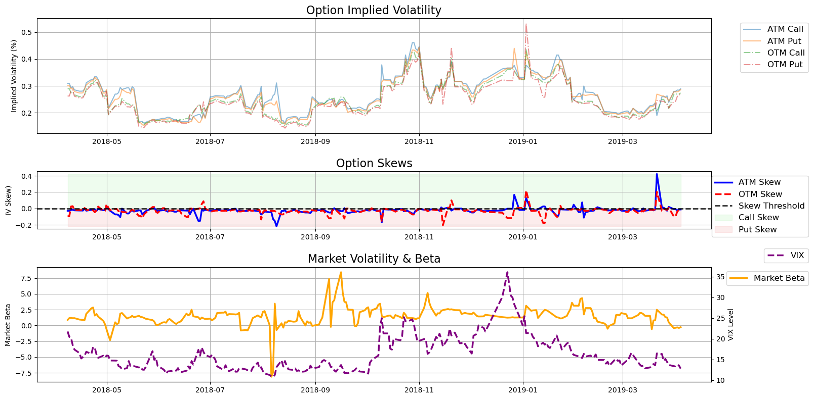{width="100%"}

{width="100%"}

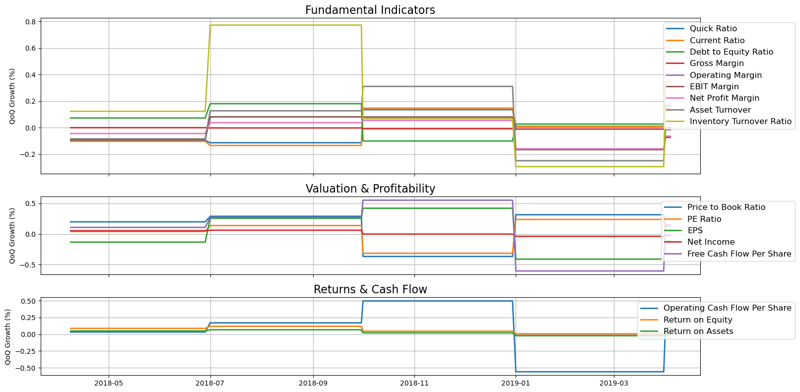{width="100%"}

## Historic 1 Month News {#historic-1-month-news-1 .unnumbered}

**Increased Regulatory Scrutiny on Tech Companies** Amid growing
concerns over data privacy and antitrust regulations, government
agencies are considering imposing stricter oversight on major tech
firms, including THE COMPANY. Analysts speculate that potential legal
battles or regulatory fines could impact THE COMPANY's ability to
innovate freely and expand its services sector.

**Supply Chain Disruptions Affecting Production** Recent reports
highlight supply chain constraints affecting key components in THE
COMPANY's flagship product. Delays in procurement and rising material
costs have forced THE COMPANY to adjust production schedules, raising
concerns about meeting consumer demand in the upcoming quarters.

**Expansion of THE COMPANY's Services Sector** THE COMPANY is
accelerating its push into subscription-based services, introducing new
offerings aimed at diversifying revenue streams beyond hardware sales.
Analysts view this as a strategic move to reduce dependency on product
cycles and strengthen long-term financial stability.

**Legal Dispute Over Intellectual Property** A recent legal battle
involving THE COMPANY and a competitor over key patents in software and
hardware integration has escalated. While THE COMPANY asserts its
technology leadership, potential litigation outcomes could impact future
product developments and licensing agreements.

**Market Reaction to Economic Indicators** Recent economic data,
including consumer spending trends and inflation reports, have
influenced investor sentiment toward THE COMPANY. Market analysts are
closely watching how macroeconomic conditions will affect THE COMPANY's
pricing strategy and global sales performance.

::: tcolorbox
Guess the action to take: *LONG* or *SHORT*.

Write a 1-2 sentence *explanation* on why you decided the action above.
:::

**NEXT PAGE**: Model's Decision and Rationale.

## LLMs' Strategy {#strategy2 .unnumbered}

The traded instrument was AAPL, with the trading period set between
2019-04-07 and 2019-05-05.

**LLMs' decision: *LONG***

**Rationale**: The analysis indicates a bullish strategy for the next
month based on several compelling factors. First, the stock's current
close price of 44.05 is above both its 20MA (42.11) and 50MA (42.86),
suggesting upward momentum (Feature: Stock_Data.Price.Close). Second,
with an RSI value of 58.26, it indicates that the stock is not
overbought yet and may have room to run higher before reaching
overbought conditions (Feature: Technical_Analysis.RSI.Value). Third,
despite recent volatility indicated by a historical volatility of
approximately 27.78%, the implied volatility at around 22.63% suggests
that options are priced favorably for potential upside moves (Feature:
Implied_Volatility.IV_Close). Fourth, fundamental growth metrics such as
EPS YoY at approximately 28% signal strong earnings potential which
supports price appreciation (Feature:
Fundamental_Data.Growth_Metrics.EPS_YoY). Lastly, news analysis reveals
positive sentiment from market analysts regarding improved production
capabilities; this aligns with pricing trends and reinforces confidence
in future profitability due to reduced dependence on external suppliers.

**Top weighted features influencing this decision**:

Stock_Data.Price.Close (44.05)

Technical_Analysis.RSI.Value (58.26)

Implied_Volatility.IV_Close (22.63%)

Fundamental_Data.Growth_Metrics.EPS_YoY (28%)

Historical_Volatility (27.78%)

**Key news impacting this strategy**:

Market analysts upgraded ratings on THE COMPANY due to improved
production capabilities - Market Impact Score: 4/5

The strategic shift to self-manufactured chips potentially enhancing
profit margins - Market Impact Score: 4/5

Mixed sentiments about production targets indicating cautious optimism
but manageable risk - Market Impact Score: 3/5

**LLM Decision Insights**

  **LLM Decision Insights**     **Value**
  --------------------------- -------------
  Long Probability                0.65
  Short Probability               0.35
  Perplexity                   9.14316e+15
  Total Tokens                    38845
  Total Cost (USD)             \$0.006040

## Following Month Data {#following-month-data-1 .unnumbered}

**Performance Metrics**

  **Metric**                        **Value**
  -------------------------------- -----------
  Sharpe Ratio (Annualized SR)       1.89417
  Portfolio Turnover (PTR)              0
  Maximum Drawdown (MDD)            0.0893178
  Mean Drawdown Duration (MDDur)        5
  Cumulative Returns                0.0484561

{width="100%"}

{width="100%"}

::: tcolorbox
Fill in the Expert Scoring *rubric*.

If applicable, provide *examples* to correct the strategy.
:::

1

# LLM Strategy 3 {#app:s3 .unnumbered}

## Historic 1 Year Data {#historic-1-year-data-2 .unnumbered}

{width="100%"}

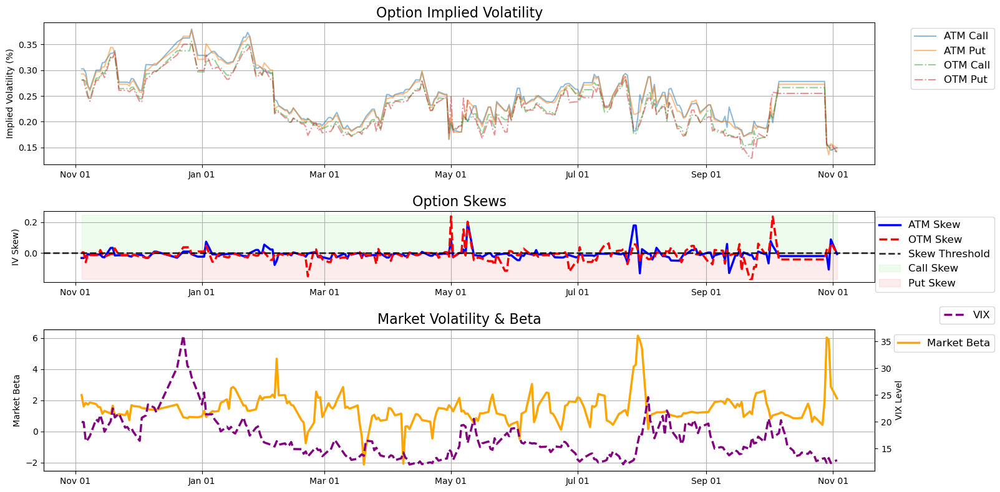{width="100%"}

{width="100%"}

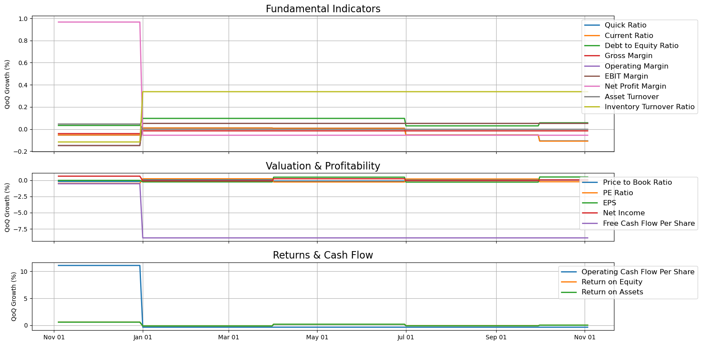{width="100%"}

## Historic 1 Month News {#historic-1-month-news-2 .unnumbered}

**Regulatory Scrutiny on Data Privacy** THE COMPANY is facing increased
regulatory attention over data privacy concerns. Lawmakers are
considering stricter policies that could impact THE COMPANY's
advertising and services revenue. Investors are closely watching
potential changes that might affect business operations and user
engagement.

**Supply Chain Disruptions and Production Adjustments** Reports indicate
that THE COMPANY is experiencing supply chain constraints, leading to
adjustments in production targets. While THE COMPANY is working to
mitigate these issues through alternative sourcing strategies, analysts
are concerned about potential delays in delivering key products to
market.

**Expansion into Subscription-Based Services** THE COMPANY is
accelerating its transition into subscription-based services,
introducing new offerings that aim to reduce dependence on hardware
sales. Analysts view this as a strategic move that could provide more
consistent revenue streams amid fluctuating device sales.

**Legal Disputes Over Patents and Licensing** A legal dispute has
emerged between THE COMPANY and a competitor over intellectual property
related to software and hardware integration. The outcome of this case
could have long-term implications for THE COMPANY's innovation strategy
and licensing agreements.

**Macroeconomic Factors Impacting Market Performance** Recent economic
indicators, including inflation and consumer spending trends, have
influenced investor sentiment toward THE COMPANY. Analysts are
evaluating how broader market conditions could affect THE COMPANY's
pricing strategies and overall demand for its products.

::: tcolorbox
Guess the action to take: *LONG* or *SHORT*.

Write a 1-2 sentence *explanation* on why you decided the action above.
:::

**NEXT PAGE**: Model's Decision and Rationale.

## LLMs' Strategy {#strategy3 .unnumbered}

The traded instrument was GOOGL, with the trading period set between
2019-11-04 and 2019-12-02.

**LLMs' decision: *LONG***

**Rationale**: The current analysis indicates a positive outlook for the
stock based on several key factors. Firstly, the stock is trading above
its 20-day moving average (61.15) and shows strong weekly past returns
(1.66%, 1.23%, 2.19%, 0.24%), suggesting bullish momentum despite recent
price dips below the MA levels, particularly influenced by external
competition pressures.

Secondly, while the RSI value is at 39.67 indicating it's approaching
oversold territory, this suggests potential for a rebound which aligns
with recent analyst upgrades and positive earnings projections that hint
at strong future demand in an evolving EV market.

Thirdly, macroeconomic indicators such as GDP growth (0.0099) and PMI
(51.1), along with declining Treasury yields (-0.457), suggest a risk-on
environment favorable for high-growth tech stocks like ours.

Fourthly, news factors also play a crucial role: \"Analysts predict
significant rebounds in deliveries,\" score of \*\*4 out of 5\*\*;
\"Strategic collaboration expected to enhance product offerings,\" score
of \*\*5 out of 5\*\*; and \"Analyst upgrades suggest bullish outlook,\"
score of \*\*4 out of 5\*\*, all indicate strong market confidence.

Lastly, considering the implied volatility skews are stable relative to
historical volatility levels supports taking on positions anticipating
upward movement as investor sentiment improves post-competition
announcements.

**Top weighted features influencing this decision**:

Stock_Data.Price.Close (61.15)

Technical_Analysis.RSI.Value (39.67)

Macro_Indicators.GDP_QoQ (0.0099)

Macro_Indicators.PMI (51.1)

Implied_Volatility.IV_Close (-0.457)

**Key news impacting this strategy**:

Analysts predict significant rebounds in deliveries - Market Impact
Score: 4/5

Strategic collaboration expected to enhance product offerings - Market
Impact Score: 5/5

Analyst upgrades suggest bullish outlook - Market Impact Score: 4/5

**LLM Decision Insights**

  **LLM Decision Insights**     **Value**
  --------------------------- -------------
  Long Probability                0.75
  Short Probability               0.25
  Perplexity                   5.36689e+29
  Total Tokens                    21817
  Total Cost (USD)             \$0.003487

## Following Month Data {#following-month-data-2 .unnumbered}

**Performance Metrics**

  **Metric**                         **Value**
  -------------------------------- -------------
  Sharpe Ratio (Annualized SR)       -0.299606
  Portfolio Turnover (PTR)               0
  Maximum Drawdown (MDD)             0.0335933
  Mean Drawdown Duration (MDDur)      4.42857
  Cumulative Returns                -0.00201332

{width="100%"}

{width="100%"}

::: tcolorbox
Fill in the Expert Scoring *rubric*.

If applicable, provide *examples* to correct the strategy.
:::

# LLM Strategy 4 {#app:s4 .unnumbered}

## Historic 1 Year Data {#historic-1-year-data-3 .unnumbered}

{width="100%"}

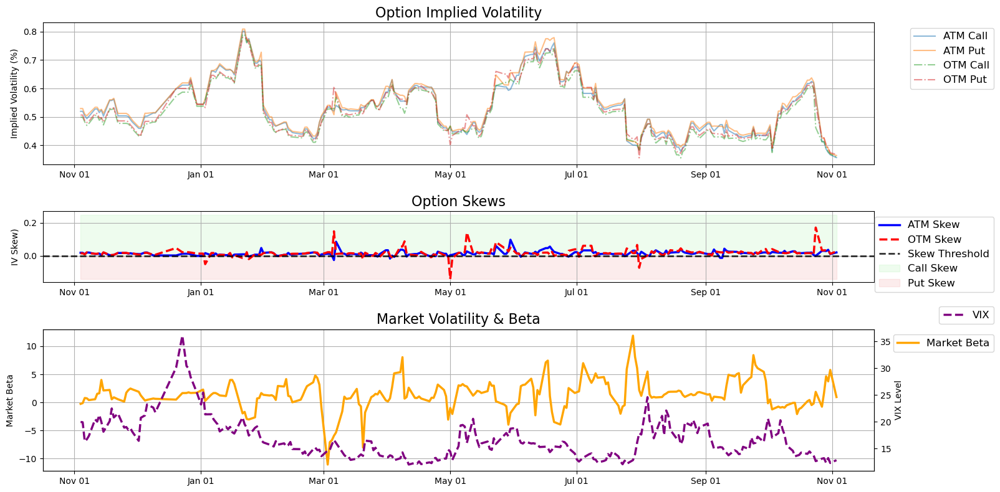{width="100%"}

{width="100%"}

{width="100%"}

## Historic 1 Month News {#historic-1-month-news-3 .unnumbered}

**Earnings Report Surpasses Expectations** THE COMPANY reported earnings
significantly above market expectations, with stronger-than-anticipated
revenue and profitability. Analysts had projected a loss, but THE
COMPANY's financials demonstrated resilience, driven by improved
operational efficiency and cost management.

**Strategic Partnership to Enhance Product Offerings** THE COMPANY
announced a strategic collaboration with a major technology firm to
enhance its next-generation product capabilities. This move is expected
to improve market competitiveness and expand offerings, reinforcing its
position in the industry.

**Market Confidence Boosted by Analyst Upgrades** Several analysts
revised their ratings upward for THE COMPANY, citing strong future
growth prospects and improving financial stability. Investor sentiment
turned more positive following these upgrades, leading to increased
stock momentum.

**Macroeconomic Factors Favoring THE COMPANY** Economic indicators,
including GDP growth and declining treasury yields, have contributed to
a favorable market environment for THE COMPANY. These factors have led
to increased investor confidence in high-growth stocks, benefiting THE
COMPANY's valuation.

**Competitive Market Pressures Intensify** A major competitor introduced
a new product line, intensifying competition within the sector. While
this development poses challenges, THE COMPANY's recent strategic
initiatives and product advancements are expected to mitigate the
competitive impact.

::: tcolorbox
Guess the action to take: *LONG* or *SHORT*.

Write a 1-2 sentence *explanation* on why you decided the action above.
:::

**NEXT PAGE**: Model's Decision and Rationale.

## LLMs' Strategy {#strategy4 .unnumbered}

The traded instrument was TSLA, with the trading period set between
2019-11-04 and 2019-12-02.

**LLMs' decision: *LONG***

**Rationale**: The decision to pursue a LONG strategy is supported by
multiple factors indicating bullish momentum and favorable market
conditions. Key features include:

**Stock_Data.Price.Close**: The current price of 16.21 is above the 20MA
(15.96) and the 50MA (15.50), suggesting positive momentum.

**Technical_Analysis.RSI.Value**: With an RSI of 55, the stock indicates
potential for further upside as it approaches overbought territory
(\>70).

**Options_Data.Atm_IV_Skews**: The ATM IV skew shows stability, which
coupled with high implied volatility suggests readiness to capitalize on
upward price movement.

**Growth Metrics (EPS YoY)**: Although EPS YoY is negative at -16%,
recent news suggests expected recovery due to new product demand and
operational efficiencies from new facilities.

**Macro_Data.SPX.Close_Slope**: The SPX close slope indicates a slight
bearish trend; however, VIX trends are showing reduced fear in the
market, supporting risk-on behavior.

**Key news impacting this strategy**:

Positive delivery statistics reported by THE COMPANY indicate a rebound
in sales - Market Impact Score: 5/5

Analysts raise price targets citing anticipated revenue growth - Market
Impact Score: 4/5

THE COMPANY announces plans for a new Gigafactory in Berlin, enhancing
production efficiency - Market Impact Score: 4/5

**LLM Decision Insights**

  **LLM Decision Insights**     **Value**
  --------------------------- -------------
  Long Probability                0.75
  Short Probability               0.25
  Perplexity                   8.61386e+12
  Total Tokens                    21937
  Total Cost (USD)             \$0.003532

## Following Month Data {#following-month-data-3 .unnumbered}

**Performance Metrics**

  **Metric**                        **Value**
  -------------------------------- -----------
  Sharpe Ratio (Annualized SR)       2.18892
  Portfolio Turnover (PTR)              0
  Maximum Drawdown (MDD)            0.0851064
  Mean Drawdown Duration (MDDur)     3.63636
  Cumulative Returns                0.0553191

{width="100%"}

{width="100%"}

::: tcolorbox
Fill in the Expert Scoring *rubric*.

If applicable, provide *examples* to correct the strategy.
:::

# LLM Strategy 5 {#app:s5 .unnumbered}

## Historic 1 Year Data {#historic-1-year-data-4 .unnumbered}

{width="100%"}

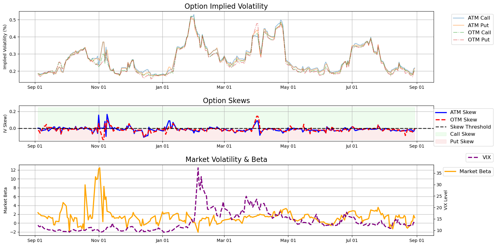{width="100%"}

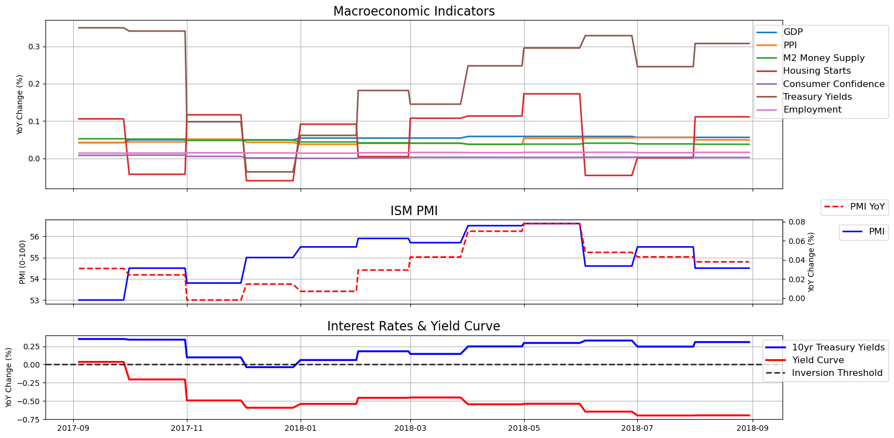{width="100%"}

{width="100%"}

## Historic 1 Month News {#historic-1-month-news-4 .unnumbered}

**Retail Sector Volatility and THE COMPANY's Market Position** Amid
ongoing shifts in the retail landscape, THE COMPANY has faced increasing
competitive pressure from digital retailers, leading to significant
fluctuations in stock performance. Recent industry-wide movements have
shown that investors are using THE COMPANY as a key indicator for
traditional retail stability. Analysts suggest that continued adaptation
to e-commerce trends will be crucial for THE COMPANY's future growth.

**Strategic Expansion into Direct-to-Consumer Sales** THE COMPANY has
strengthened its focus on direct-to-consumer sales, enhancing its online
platform and reducing reliance on third-party distribution. This shift
has resulted in improved margins and greater control over customer
engagement. Analysts believe that this strategy could protect THE
COMPANY from broader market shifts while ensuring sustained revenue
growth.

**Executive Leadership Changes and Market Reactions** THE COMPANY
announced key executive leadership changes, appointing a new senior
figure to lead innovation and digital transformation efforts. The market
reacted positively to the appointment, with investors expressing
confidence in the company's renewed focus on operational efficiency and
strategic growth.

**Increased Competition in Key Market Segments** Recent reports indicate
that THE COMPANY is facing heightened competition in one of its core
market segments, with rival firms aggressively expanding their
offerings. Analysts predict that maintaining brand strength and customer
loyalty will be critical to counteracting these competitive threats.

**Analyst Upgrades Amid Optimistic Growth Projections** Several analysts
have revised their outlook on THE COMPANY, citing improvements in
product innovation, operational efficiency, and supply chain management.
The stock price saw an upward movement following the revised
projections, reflecting renewed investor confidence in the company's
long-term strategy.

::: tcolorbox
Guess the action to take: *LONG* or *SHORT*.

Write a 1-2 sentence *explanation* on why you decided the action above.
:::

**NEXT PAGE**: Model's Decision and Rationale.

## LLMs' Strategy {#strategy5 .unnumbered}

The traded instrument was AMZN, with the trading period set between
2018-09-03 and 2019-10-01.

**LLMs' decision: *LONG***

**Rationale**: The analysis supports a LONG position based on several
compelling indicators. Firstly, the stock is currently trading above its
20MA (90.00) and 50MA (86.47), signaling positive momentum with a recent
close at 91.72, indicating strength in price action. Secondly, the RSI
value of 60.43 suggests that while the stock is not overbought yet, it
is trending positively which could indicate further upside potential.

Thirdly, despite some mixed analyst views regarding valuation and
short-term volatility due to trade tensions and tariffs, there are also
positive indicators such as analyst upgrades for THE COMPANY's stock
target suggesting expected growth, which impacts sentiment positively.

From a fundamental perspective, EPS YoY growth of approximately 8.67%
indicates solid profitability trends, even though free cash flow has
seen negative movement (-5.60%), showing resilience in earnings
generation under pressure.

Lastly, macro data showing SPX closing slope $>$ 0 and VIX slope $<$ 0
indicate bullish market sentiment overall, further reinforcing our
decision.

**Top weighted features influencing this decision**:

Stock_Data.Price.Close (91.72)

Technical_Analysis.RSI.Value (60.43)

Fundamental_Data.Growth_Metrics.EPS_YoY (8.67%)

Moving_Averages.50MA (86.47)

Macro_Data.Market_Sentiment (Bullish)

**Key news impacting this strategy**:

THE COMPANY reached a \$1 trillion market cap post-Prime Day, boosting
sales - Market Impact Score: 5/5

Analyst upgrades suggest continued growth expectations - Market Impact
Score: 4/5

Launch of a new machine learning shopping platform enhances
competitiveness - Market Impact Score: 3/5

**LLM Decision Insights**

  **LLM Decision Insights**     **Value**
  --------------------------- -------------
  Long Probability                0.75
  Short Probability               0.25
  Perplexity                   2.38182e+29
  Total Tokens                    46337
  Total Cost (USD)             \$0.007181

## Following Month Data {#following-month-data-4 .unnumbered}

**Performance Metrics**

  **Metric**                        **Value**
  -------------------------------- ------------
  Sharpe Ratio (Annualized SR)       -1.70178
  Portfolio Turnover (PTR)              0
  Maximum Drawdown (MDD)            0.0645225
  Mean Drawdown Duration (MDDur)       10.5
  Cumulative Returns                -0.0334379

{width="100%"}

{width="100%"}

::: tcolorbox
Fill in the Expert Scoring *rubric*.

If applicable, provide *examples* to correct the strategy.
:::

# LLM Strategy 6 {#app:s6 .unnumbered}

## Historic 1 Year Data {#historic-1-year-data-5 .unnumbered}

{width="100%"}

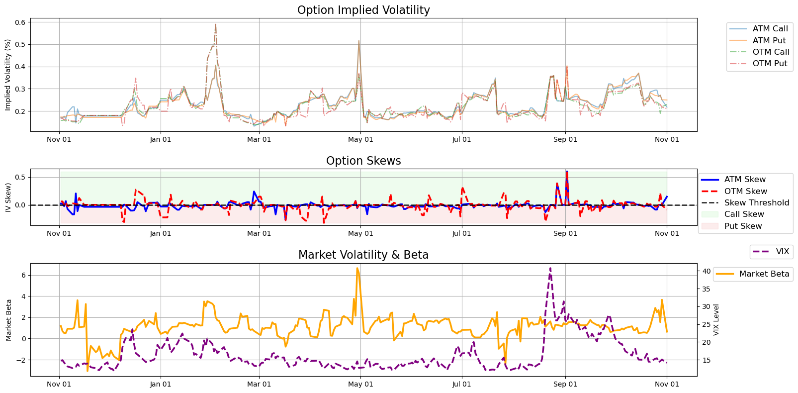{width="100%"}

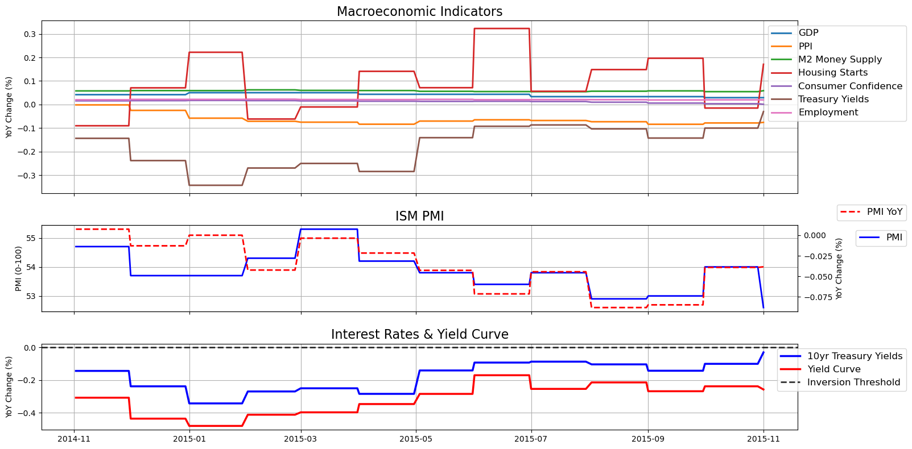{width="100%"}

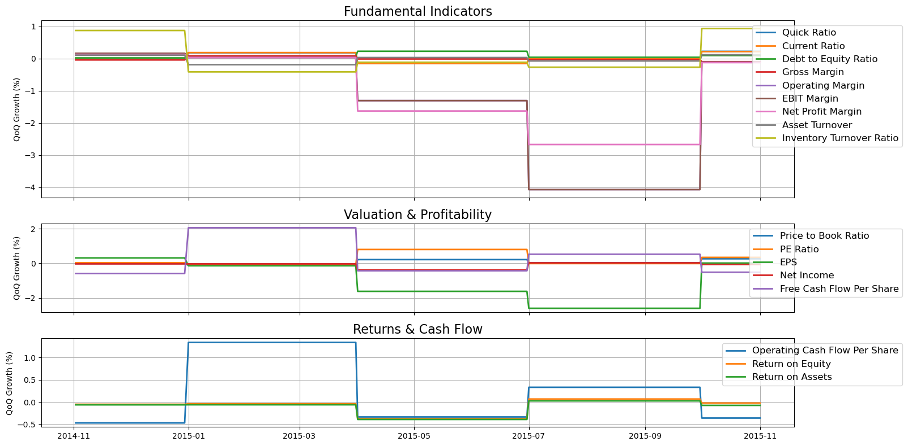{width="100%"}

## Historic 1 Month News {#historic-1-month-news-5 .unnumbered}

**Unusual Options Activity and Market Speculation** Options traders
exhibited significant bullish sentiment toward THE COMPANY, with heavy
call buying activity ahead of an earnings report. Analysts speculated
that this could signal confidence in strong financial performance and
future growth prospects. This led to increased volatility and a
short-term uptick in THE COMPANY's stock price.

**Leadership and Board Expansion** THE COMPANY announced the nomination
of two senior executives to its board of directors, reinforcing its
strategic vision and corporate governance. The move was widely
interpreted as an effort to strengthen leadership in key growth areas.
Investor sentiment was cautiously optimistic, with market analysts
viewing the expansion as a sign of long-term strategic planning.

**Earnings Beat and Strong Market Reaction** THE COMPANY reported
earnings that exceeded market expectations, with higher-than-expected
revenue and improved profit margins. The announcement led to a sharp
increase in its stock price in after-hours trading, as investors reacted
positively to the financial results and management's forward guidance.

**Technical Breakout and Analyst Projections** Market analysts
highlighted a bullish technical pattern in THE COMPANY's stock price,
indicating a potential breakout. Comparisons were drawn to a major
industry peer, suggesting that THE COMPANY could experience significant
upside movement. The report fueled further investor optimism, leading to
increased trading volume and a positive market response.

**Strategic Partnership in Emerging Technology** THE COMPANY announced a
collaboration with a major industry player to enhance its presence in
emerging technology sectors. The partnership was positioned as a key
strategic move to expand its ecosystem and strengthen its competitive
position. Market participants reacted positively, seeing the deal as a
catalyst for future revenue growth and innovation.

**TASKS**:

::: tcolorbox
Guess the action to take: *LONG* or *SHORT*.

Write a 1-2 sentence *explanation* on why you decided the action above.
:::

## LLMs' Strategy {#strategy6 .unnumbered}

The traded instrument was MSFT, with the trading period set between
2015-11-02 and 2015-11-30.

**LLMs' decision: *LONG***

**Rationale**: The decision to take a LONG position is supported by
multiple key factors. Firstly, THE COMPANY's stock is trading at
\$45.57, above both the 20-day moving average (43.81) and the 50-day
moving average (44.74), indicating strong bullish momentum. While
historical volatility is relatively high (40%), the implied volatility
(27%) suggests that market sentiment remains stable, providing an
opportunity for controlled risk.

Secondly, technical indicators such as RSI at 60.18 suggest further
upside potential before overbought conditions set in. Fundamentally,
despite a decline in EPS YoY (-12.68%), free cash flow growth of 28.99%
highlights strong liquidity and operational efficiency, reinforcing the
bullish case.

Macroeconomic conditions also favor a long position, with GDP QoQ at
0.18% and declining market volatility (VIX down 7%), indicating a
risk-on sentiment. The broader market (SPX) is also in an upward trend
(+1%), adding further confidence in equities.

**Top weighted features influencing this decision**:

Stock_Data.Price.Close (45.57)

Technical_Analysis.MACD.Value (0.312)

Fundamental_Data.Growth_Metrics.Free_Cash_Flow_YoY (28.99%)

Technical_Analysis.RSI (60.18)

Market_Data.SPX.Slope (+1%)

**Key news impacting this strategy**:

Earnings expectations from major companies expected to positively
influence stock prices - Market Impact Score: 5/5

Mixed performance in overall earnings season could favor THE COMPANY if
it meets estimates - Market Impact Score: 4/5

Analysts predicting challenges yet potentially manageable impacts on
flagship product demand - Market Impact Score: 3/5

  **LLM Decision Insights**    **Value**
  --------------------------- ------------
  Long Probability                0.82
  Short Probability               0.18
  Total Tokens                   17744
  Total Cost (USD)             \$0.002885

## Following Month Data {#following-month-data-5 .unnumbered}

**Performance Metrics**

  **Metric**                        **Value**
  -------------------------------- -----------
  Sharpe Ratio (Annualized SR)       1.47043
  Portfolio Turnover (PTR)              0
  Maximum Drawdown (MDD)            0.0378733
  Mean Drawdown Duration (MDDur)     7.17647
  Cumulative Returns                0.0195753

{width="100%"}

{width="100%"}

::: tcolorbox
Fill in the Expert Scoring *rubric*.

If applicable, provide *examples* to correct the strategy.
:::

# LLM Strategy 7 {#app:s7 .unnumbered}

## Historic 1 Year Data {#historic-1-year-data-6 .unnumbered}

{width="100%"}

{width="100%"}

{width="100%"}

{width="100%"}

## Historic 3 Month News {#historic-3-month-news .unnumbered}

**Strong Financial Performance & Earnings Beat** THE COMPANY reported a
significant earnings beat, posting revenue and profit figures well above
analysts' expectations. The surprise profitability fueled a sharp
increase in THE COMPANY's stock price, surging over 10% in after-hours
trading. Investors reacted positively to the strong growth across
multiple segments, particularly in cloud services and digital media.

**Work Culture Controversy & Public Backlash** A major publication
released an investigative report criticizing THE COMPANY's workplace
culture, citing allegations of excessive pressure, harsh management
practices, and unfair treatment of employees. THE COMPANY's top
executives, including THE VP, issued a strong rebuttal, claiming the
report was misleading and lacked journalistic standards. While the news
initially weighed on investor sentiment, the company's stock remained
resilient amid continued business growth.

**Expansion in Logistics & Delivery Services** THE COMPANY announced the
expansion of its same-day delivery service to multiple metropolitan
areas, increasing its footprint in the logistics space. The move was
seen as a direct challenge to traditional courier services and
positioned THE COMPANY as a dominant force in e-commerce fulfillment.
Analysts viewed the expansion favorably, citing enhanced customer
experience and potential cost efficiencies.

**Major Hiring Initiative for Seasonal Workforce** Ahead of the holiday
season, THE COMPANY revealed plans to hire over 100,000 temporary
workers to meet rising demand. The announcement signaled confidence in
consumer spending and THE COMPANY's ability to handle peak shopping
periods. Market reaction was positive, with analysts expecting a strong
quarter driven by increased retail sales.

**Regulatory Scrutiny Over Tax Practices** THE COMPANY faced renewed
scrutiny from regulatory bodies regarding its tax structure and alleged
use of offshore subsidiaries to minimize tax obligations. While no
immediate penalties were imposed, the heightened regulatory attention
created some uncertainty for investors. However, the stock showed
limited reaction as the broader market remained focused on the company's
robust growth prospects.

**TASKS**:

::: tcolorbox
Guess the action to take: *LONG* or *SHORT*.

Write a 1-2 sentence *explanation* on why you decided the action above.
:::

## LLMs' Strategy {#strategy7 .unnumbered}

The traded instrument was AMZN, with the trading period set between
2015-11-02 and 2015-11-30.

**LLMs' decision: *LONG***

**Rationale**: The analysis indicates a bullish sentiment for the stock
based on several key factors.

1\) **Technical Analysis**: The current price of 26.63 is above both the
20MA (26.20) and 50MA (26.07), indicating strong upward momentum. The
RSI value at 55 suggests that the stock is neither overbought nor
oversold, supporting potential further upside.

2\) **Stock Performance**: Recent weekly returns show significant
volatility with a cumulative return of approximately 1% in recent weeks,
suggesting positive market interest and possible trend sustainability.

3\) **News Factors**: Analysts have raised their price target for the
company due to underappreciated growth potential in its cloud services
(Market Impact Score: 5). Additionally, early Black Friday deals
announced by executives could significantly enhance sales (Score: 4).
Lastly, the launch of brick-and-mortar stores leveraging online data can
improve customer engagement (Score: 3). These news factors collectively
support a bullish stance as they highlight strong growth narratives
around profitability and revenue generation prospects amidst favorable
technical indicators.

**Top weighted features influencing this decision**:

Stock_Data.Price.Close (26.63)

Technical_Analysis.RSI.Value (55)

Technical_Analysis.20MA (26.20)

Technical_Analysis.50MA (26.07)

Fundamental_Data.Growth_Metrics.Revenue_YoY (+21%)

**Key news impacting this strategy**:

Official launch of first brick-and-mortar store leveraging online data
for inventory - Market Impact Score: 3

Analysts predict significant disruption in IT market due to cloud
services growth - Market Impact Score: 5

Announcement of extensive Black Friday deals with early access for
premium members - Market Impact Score: 4

Price target increase by major investment bank citing strong cloud
division outlook - Market Impact Score: 5

Major retailer transitions online store to THE COMPANY, reinforcing
retail dominance - Market Impact Score: 3

**LLM Decision Insights**

  **LLM Decision Insights**    **Value**
  --------------------------- ------------
  Long Probability                0.75
  Short Probability               0.25
  Perplexity                    1.92457
  Total Tokens                   68462
  Total Cost (USD)             \$0.010503

## Following Month Data {#following-month-data-6 .unnumbered}

**Performance Metrics**

  **Metric**                        **Value**
  -------------------------------- -----------
  Sharpe Ratio (Annualized SR)       3.76259
  Portfolio Turnover (PTR)              0
  Maximum Drawdown (MDD)            0.0457516
  Mean Drawdown Duration (MDDur)     3.57143
  Cumulative Returns                0.0809082

{width="100%"}

{width="100%"}

::: tcolorbox
Fill in the Expert Scoring *rubric*.

If applicable, provide *examples* to correct the strategy.
:::

# LLM Strategy 8 {#app:s8 .unnumbered}

## Historic 1 Year Data {#historic-1-year-data-7 .unnumbered}

{width="100%"}

{width="100%"}

{width="100%"}

{width="100%"}

## Historic 1 Month News {#historic-1-month-news-6 .unnumbered}

**Tech Summit Participation and Market Sentiment** THE COMPANY's
participation in a high-profile technology summit hosted by government
officials was seen as a significant opportunity for collaboration on
innovation and job creation. However, concerns arose over the selective
nature of attendees, leading to speculation about favoritism. Market
sentiment towards THE COMPANY remained stable, though some investors
questioned potential regulatory risks stemming from government
involvement.

**Increased Competition in the Industry** A major competitor of THE
COMPANY announced advancements in self-driving technology, boasting
extensive real-world testing data. Analysts highlighted that while THE
COMPANY has been a leader in the space, increased competition could
impact its market share and long-term profitability. The news led to
mixed reactions, with some investors confident in THE COMPANY's ability
to maintain its lead, while others expressed caution.

**Speculation on Strategic Partnerships and Buyouts** Rumors emerged
regarding a potential acquisition involving THE COMPANY, sparking
volatility in its stock price. While no official confirmation was
provided, analysts speculated on the strategic value of such a deal.
Some investors saw the speculation as a sign of THE COMPANY's
attractiveness in the market, while others remained skeptical about the
feasibility of a merger.

**Increased Focus on Artificial Intelligence Development** THE COMPANY
announced increased investments in artificial intelligence and
automation, reinforcing its commitment to future growth in the
technology sector. Analysts viewed this as a positive move, particularly
as competitors ramped up their own AI initiatives. However, concerns
remained regarding the potential regulatory scrutiny and ethical
implications of expanded AI deployment.

**Consumer Data and Privacy Concerns** Reports surfaced regarding THE
COMPANY's collection and usage of consumer data, leading to discussions
about privacy regulations and transparency. While THE COMPANY maintained
that its practices comply with existing regulations, some analysts
warned that growing public and governmental scrutiny could lead to
stricter policies, impacting THE COMPANY's ability to leverage data for
competitive advantage.

## LLMs' Strategy {#strategy8 .unnumbered}

The traded instrument was GOOGL, with the trading period set between
2017-01-02 and 2017-01-30.

**LLMs' decision: *LONG***

**Rationale**: The analysis suggests a LONG position due to several
bullish indicators. Firstly, the company's technical metrics are showing
positive momentum, with the stock price trading above its 50MA (38.22)
and maintaining stability above the 200MA. Recent weekly returns also
indicate recovery trends, with a reversal from previous declines.

Secondly, fundamental indicators show solid growth potential: EPS YoY
growth at 2.7% and Free Cash Flow YoY exceeding 100% reflect a strong
financial position and operational efficiency.

Furthermore, macroeconomic conditions are favorable, with GDP growth
(1%) and PMI values above 50, suggesting an expanding economy. Analysts'
sentiment remains positive, with price target revisions reflecting
confidence in THE COMPANY's revenue trajectory.

**Top weighted features influencing this decision**:

Stock_Data.Price.Close (38.22)

Technical_Analysis.RSI.Value (39)

Fundamental_Data.Growth_Metrics.EPS_YoY (2.7%)

Fundamental_Data.Cash_Flow_Metrics.Free_Cash_Flow_YoY (\>100%)

News_Factors.Analyst_Price_Target_Increase (Impact Score: 5)

**Key news impacting this strategy**:

Market analysts raise price targets for THE COMPANY due to strong
performance in digital advertising - Market Impact Score: 5/5

THE COMPANY collaborates with major automotive firms for product
integration - Market Impact Score: 4/5

Investment in AI and automation expected to improve future offerings -
Market Impact Score: 4/5

Strategic executive appointment raises market confidence in THE
COMPANY's leadership - Market Impact Score: 3/5

Expansion into new product categories expected to drive future revenue
growth - Market Impact Score: 3/5

**LLM Decision Insights**

  **LLM Decision Insights**    **Value**
  --------------------------- ------------
  Long Probability                0.75
  Short Probability               0.25
  Perplexity                    1.88728
  Total Tokens                   13112
  Total Cost (USD)             \$0.002181

## Following Month Data {#following-month-data-7 .unnumbered}

**Performance Metrics**

  **Metric**                        **Value**
  -------------------------------- -----------
  Sharpe Ratio (Annualized SR)       0.96102
  Portfolio Turnover (PTR)              0
  Maximum Drawdown (MDD)            0.0503262
  Mean Drawdown Duration (MDDur)      2.75
  Cumulative Returns                0.0128745

{width="100%"}

{width="100%"}

::: tcolorbox
Fill in the Expert Scoring *rubric*.

If applicable, provide *examples* to correct the strategy.
:::

# LLM Strategy 9 - No News Analyst Agent {#app:s9 .unnumbered}

In this ensemble, only the strategist and the evaluator agents were
enabled.

## Historic 1 Year Data {#historic-1-year-data-8 .unnumbered}

{width="100%"}

{width="100%"}

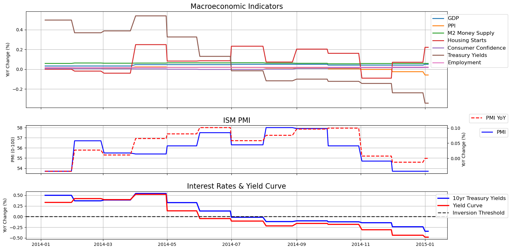{width="100%"}

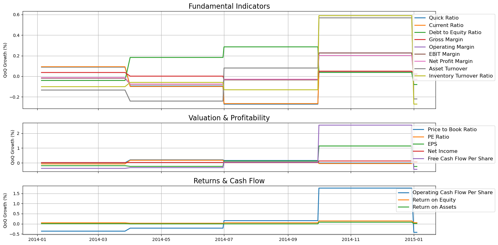{width="100%"}

## Historic 1 Month News {#historic-1-month-news-7 .unnumbered}

The News Analyst agent was disabled for this sample.

::: tcolorbox
Guess the action to take: *LONG* or *SHORT*.

Write a 1-2 sentence *explanation* on why you decided the action above.
:::

**NEXT PAGE**: Model's Decision and Rationale.

## LLMs' Strategy {#strategy9 .unnumbered}

The traded instrument was AAPL, with the trading period set in between
2015-01-05 and 2015-02-02.

**LLMs' decision: *LONG***

**Rationale**: The decision to go LONG is supported by several
compelling factors. Firstly, the stock's price at \$28.66 is above both
the 20MA (\$28.41) and 50MA (\$26.63), indicating strong bullish
momentum and a positive trend in price action. Additionally, the RSI at
58 suggests that while not overbought, there is room for further upward
movement without immediate correction risk.

Moreover, recent news highlights record quarterly revenue growth of
\$74.6 billion exceeding analyst expectations, which enhances investor
confidence and positions the company favorably in the market (Market
Impact Score: 5). The analysts' upgrades to their price targets
reinforce this sentiment (Market Impact Score: 4). Furthermore, strong
sales growth of 70% in China indicates robust demand and a significant
opportunity for future revenue increases.

From a technical perspective, despite some concerns about smartphone
sales slowing down, overall growth metrics such as EPS YoY at
approximately 48%, Free Cash Flow YoY at around 58%, alongside healthy
margins (Gross Margin:  39%, Net Profit Margin:  24%), indicate solid
profitability and sustainability.

Additionally, macroeconomic indicators show positive trends with GDP QoQ
up and PMI above neutral (53.7), suggesting economic expansion which
typically supports equity performance.

**Top weighted features influencing this decision**:

Stock_Data.Price.Close (28.66)

Technical_Analysis.20MA (28.41)

Technical_Analysis.50MA (26.63)

Fundamental_Data.Growth_Metrics.EPS_YoY (48%)

Fundamental_Data.Growth_Metrics.Free_Cash_Flow_YoY (58%)

**Key news impacting this strategy**:

Record quarterly revenue of \$74.6 billion - Market Impact Score: 5/5

Analysts raised price targets following strong earnings - Market Impact
Score: 4/5

Anticipated launch of Apple Watch as new revenue stream - Market Impact
Score: 4/5

Strong revenue growth in China (70%) - Market Impact Score: 4/5

Concerns over potential slowing smartphone sales growth - Market Impact
Score: 3/5

**LLM Decision Insights**

  **LLM Decision Insights**     **Value**
  --------------------------- -------------
  Long Probability                0.78
  Short Probability               0.22
  Perplexity                   5.89012e+15
  Total Tokens                    63630
  Total Cost (USD)             \$0.009766

## Following Month Data {#following-month-data-8 .unnumbered}

**Performance Metrics**

  **Metric**                        **Value**
  -------------------------------- -----------
  Sharpe Ratio (Annualized SR)       4.17844
  Portfolio Turnover (PTR)              0
  Maximum Drawdown (MDD)            0.0535714
  Mean Drawdown Duration (MDDur)     2.77778
  Cumulative Returns                0.116297

{width="100%"}

{width="100%"}

::: tcolorbox
Fill in the Expert Scoring *rubric*.

If applicable, provide *examples* to correct the strategy.
:::

# LLM Strategy 10 {#app:s10 .unnumbered}

In this ensemble, only the strategist agent is active, the news analyst
and the evaluator were disabled.

## Historic 1 Year Data {#historic-1-year-data-9 .unnumbered}

{width="100%"}

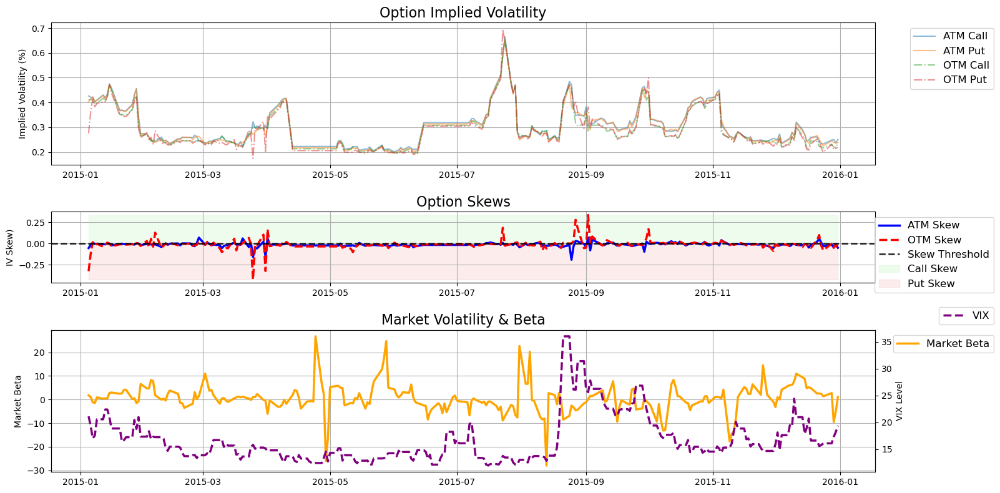{width="100%"}

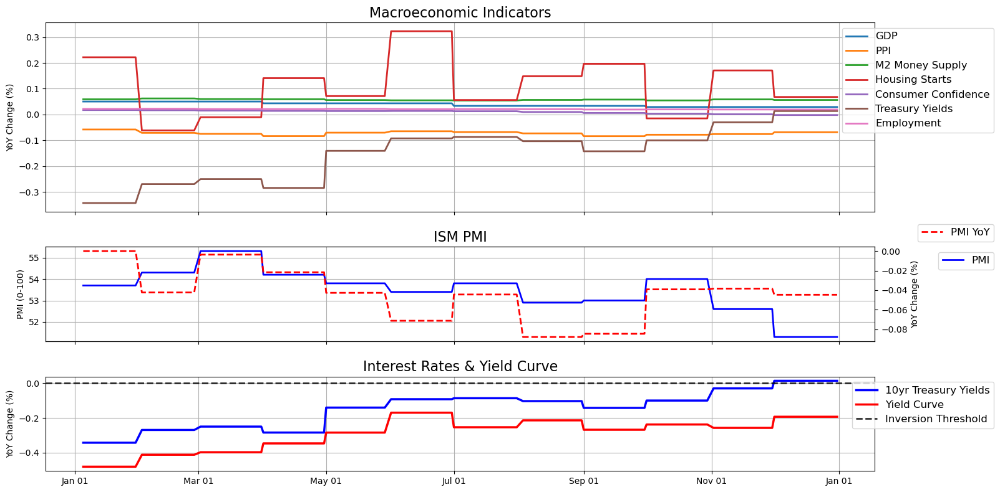{width="100%"}

{width="100%"}

## Historic 1 Month News {#historic-1-month-news-8 .unnumbered}

The News Analyst agent was disabled for this sample.

::: tcolorbox
Guess the action to take: *LONG* or *SHORT*.

Write a 1-2 sentence *explanation* on why you decided the action above.
:::

**NEXT PAGE**: Model's Decision and Rationale.

## LLMs' Strategy {#strategy10 .unnumbered}

The traded instrument was META, with the trading period set between
2016-01-04 and 2016-02-01.

**LLMs' decision: *SHORT***

**Rationale**: The stock exhibits several red flags indicating a
potential decline. Firstly, the negative EBIT Margin (-0.1333) and
Negative Net Profit Margin (-0.1278) suggest that the company is
currently operating at a loss, which can deter investors and decrease
demand for shares.

Additionally, the Current Ratio (0.1962) and Quick Ratio (0.0) indicate
severe liquidity issues, implying that the company may struggle to cover
its short-term liabilities, further increasing financial risk.

From a technical perspective, both RSI values (35.94), which is below 40
suggests weak momentum while MACD shows bearish signals with a drop in
strength over recent periods (-0.0248). The stock price has also been
trading well below its moving averages: 20MA (approx 269), 50MA (approx
334), suggesting downward pressure on price action.

Given these factors coupled with high volatility indicated by ATR of
approximately 0.0225 points towards potential price swings unfavorable
to long positions; thus establishing a short position could be
beneficial in capturing downside movement over the next month.

**LLM Decision Insights**

The evaluator agent was disabled, these insights are not precise.

  **LLM Decision Insights**     **Value**
  --------------------------- -------------
  Long Probability                 0.4
  Short Probability                0.6
  Perplexity                   5.21024e+14
  Total Tokens                    2625
  Total Cost (USD)             \$0.000540

## Following Month Data {#following-month-data-9 .unnumbered}

**Performance Metrics**

  **Metric**                        **Value**
  -------------------------------- -----------
  Sharpe Ratio (Annualized SR)       0.98081
  Portfolio Turnover (PTR)              0
  Maximum Drawdown (MDD)            0.329518
  Mean Drawdown Duration (MDDur)     8.05882
  Cumulative Returns                0.0222242

{width="100%"}

{width="100%"}

::: tcolorbox
Fill in the Expert Scoring *rubric*.

If applicable, provide *examples* to correct the strategy.
:::
